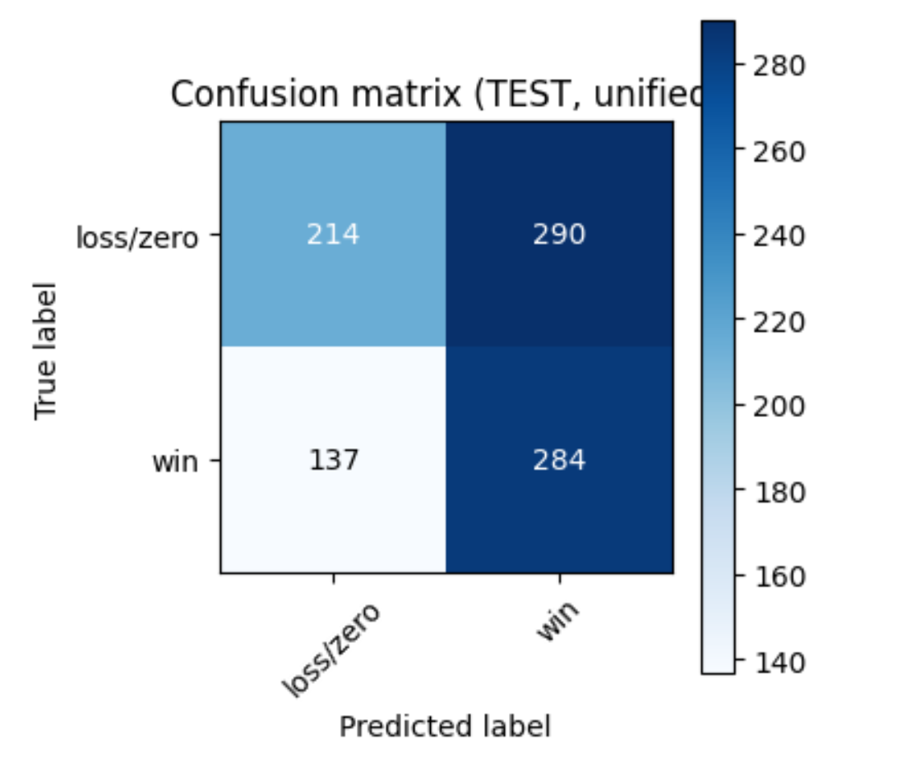
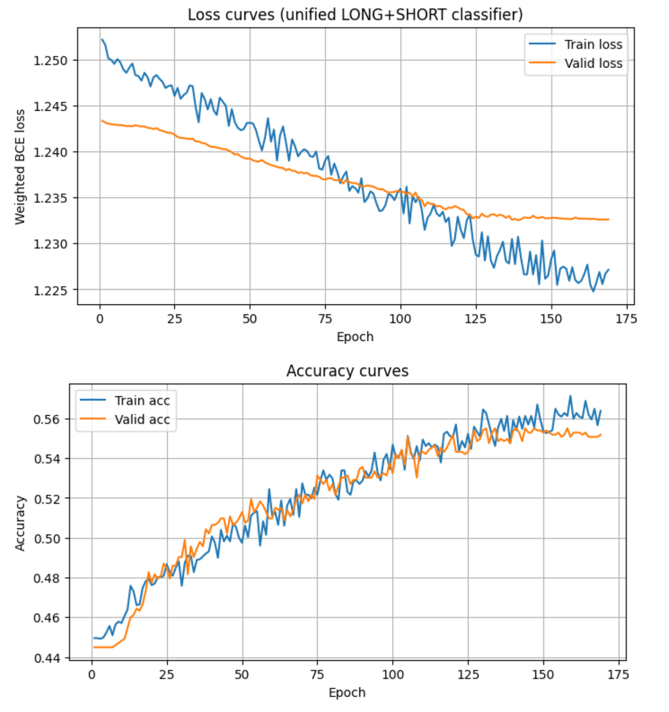
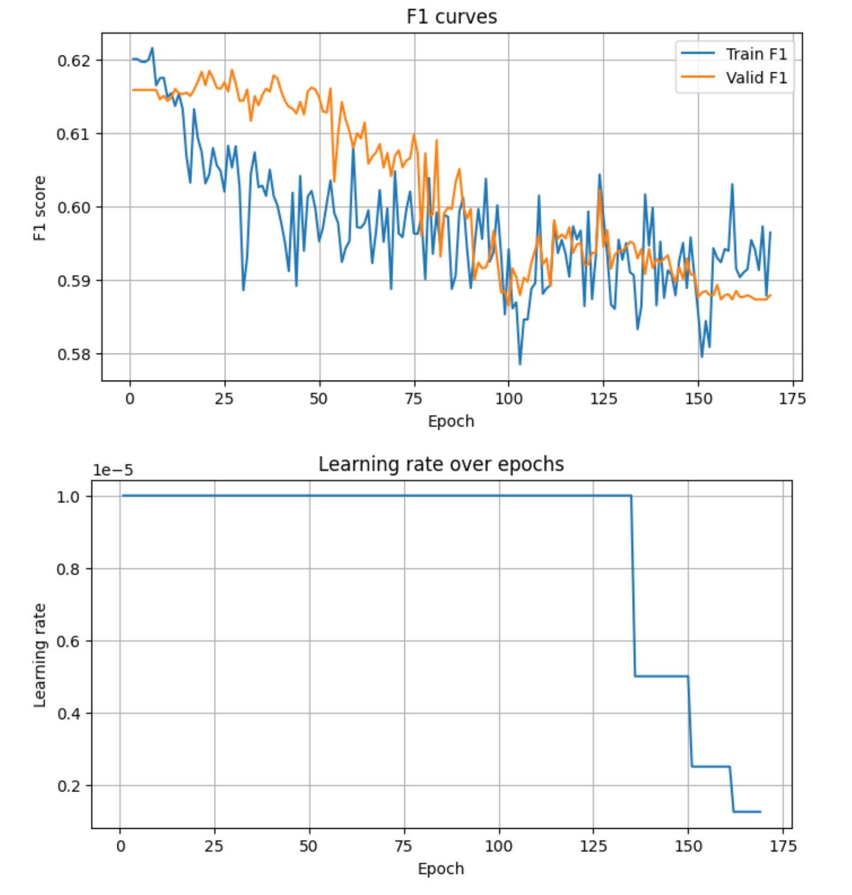

# Beszámoló – Deep Learning alapú trade-szűrés meglévő day-trading stratégiához

## Csapat
- **Csapatnév:** MarketPredict 
- **Név:** Sinkó Viktor Péter
- **Neptun-kód:** XCT9YC
- **Cél:** aláírás szerzése a tárgyból

## 1. Bevezetés

A „Deep Learning a gyakorlatban” tárgy keretében egy önálló projektet készítettem. A téma szorosan kapcsolódik a régóta fejlesztett day-trading stratégiáimhoz: egy már meglévő, NinjaTrader / NinjaScript alapú, kb. 55%-os winrate-tel rendelkező, profitábilis stratégiát szerettem volna **deep learning modellel megtámogatni**, amely a belépés pillanatában eldönti, hogy **érdemes-e egyáltalán megnyitni** az adott pozíciót.

A cél nem az volt, hogy „új tréder AI-t” írjak, hanem hogy a meglévő, szabályalapú rendszer mellé egy **osztályozó jellegű filter** kerüljön, amely várható kimenetel (nyerő/vesztes) alapján kiszűri a gyenge setupokat. Hosszabb távon a célom egy olyan modul, amit **bármely automatizált stratégia mögé be lehet kötni**, és amely képes a backtest-logokból tanulva javítani a végső PnL-t.

---

## 2. Célkitűzés és alapötlet

### 2.1. Alap stratégia

- Platform: **NinjaTrader 8**
- Nyelv: **NinjaScript (C# alapú)**
- Eszköz: **MNQ futures (Micro E-mini Nasdaq-100)**
- Alap időkeret: **5 perces gyertyák**
- Fő indikátor: **SuperTrend Dual RMA** (két külön RMA, upper/lower ST vonalak)
- Belépés: ST áttörésekre (flip) limit orderrel, fix TP-vel + dinamikus ST alapú SL, BE+1 szabállyal, N bar feletti / alatti zárással.

A stratégia önmagában is profitábilis, de sok **kis és nagy vesztes trade** kerül bele, amelyeket jó lenne elkerülni. Ezt a feladatot bíztam a deep learning modellre.

### 2.2. DL modul feladata

A modell bemenete:
- mindaz az információ, ami a belépés pillanatában (később: a tényleges fill pillanatában) elérhető a charton.

A modell kimenete:
- egy **valószínűség**, hogy az adott trade **nyerő** lesz (nettó PnL > 0).

Az operatív használat:
- ha a valószínűség egy adott küszöb felett van, a trade „átmehet”,
- ha alatta van, a stratégiától érkező jel **szűrésre kerül** (nem nyitnék éles pozíciót).

A projekt célja tehát:
- **winrate növelése**,  
- **drawdown csökkentése**,  
- **összprofit növelése**,  
mindegyik **ugyanazon alapstratégia** mellett, csupán a belépések szűrésével.

---

## 3. Adatgyűjtés és adatszerkezet

### 3.1. Adatforrás

Az adatforrást teljes egészében a NinjaTrader biztosítja. A stratégiába egy külön **logger réteget** építettem, ami minden potenciális belépésről részletes sort ír CSV-be. Ezt a loggert több iterációban fejlesztettem:

1. **Belépési jel (flip bar) logolása** – kezdeti verzió.
2. Hibák felderítése:
   - volt, hogy a log csak **egy bar-ral később** jelent meg (exit és reverse flip ütközése).
   - néha `9999` jelzésű „hány bar az utolsó ST flip óta” mezők keletkeztek hibás logika miatt.
   - részfilles exit környékén pontatlan PnL érték jelent meg (sor szétesés).
3. **Véglegesített verzió**:
   - stabil **ST flip visszakeresés** (minden trade-hez helyes `bars_since_last_st_flip`).
   - külön számláló a **mai ST flipek számára** (`st_flips_today`).
   - korrekten kezelt részfilles exit (kumulált mennyiség, súlyozott átlagár).
   - **minden trade kimenetele** (TP, SL, stratégiai zárás, session close, NotFilled) rögzítésre kerül nettó PnL-lel.

A gyűjtött adat:
- Időszak: **2020.01.01 – 2025.11.13.**
- Napi átlag kb. 3 trade,
- Összesen nagyságrendileg **~2.3k LONG** és **~2.3k SHORT** trade.

### 3.2. Két külön CSV

A logger két külön állományt hoz létre:

- `STDL_LongLog.csv` – csak long irányú belépések,
- `STDL_ShortLog.csv` – csak short irányú belépések.

A megvalósítás során fontos volt, hogy **egy trade = egy sor** legyen, világos mappinggel a NinjaTrader orderjei és a logger sample-ID-je között.

### 3.3. Feature-k (oszlopok) – snapshot

Egy sorhoz tartozó „pillanatfelvétel” mezők:

- `sample_id` – egyedi ID (Guid).
- `timestamp` – a belépési döntés időpontja.
- `instrument`, `session_date`, `direction`.
- `order_offset_ticks` – a limit order ára hány tickre van az aktuális záróártól.
- `minutes_from_open` – percek a napi session nyitásától.
- `dow_mon` … `dow_fri` – a hét napja one-hot kódolva.
- `vol_regime20` – az utolsó 20 bar loghozamainak szórása, volatilitásként.
- `ret_since_session_open_pct` – az ár elmozdulása a mai nyitóárhoz képest.
- `bars_since_last_st_flip` – hány bar telt el az **utolsó SuperTrend flip** óta (a jelenlegi bar előtt).
- `st_flips_today` – hány ST flip történt az adott napon a jelenlegi barig bezárólag.

**Magasabb idősíkok (15m és 60m) pillanatképei:**

- `htf15_dist_ema50_atr`, `htf15_dist_ema200_atr` – a 15 perces close távolsága az EMA50 / EMA200-tól, ATR-rel skálázva.
- `htf15_rsi14_scaled` – 15 perces RSI (0–1 közé skálázva).
- `htf60_dist_ema50_atr`, `htf60_dist_ema200_atr`, `htf60_rsi14_scaled` – ugyanez 60 perces idősoron.

Ezek adnak képet arról, hogy **mekkora trendben**, melyik irányba mozog a piac nagyobb skálán, és hogy inkább trend-fázisban vagy mean-reversion fázisban vagyunk-e.

### 3.4. Feature-k – idősor (160 × 18)

Minden trade-hez tartozik egy **160 bar hosszú idősor** 18 csatornával (feature), ahol `_1` a legfrissebb zárt bar, `_160` a legrégebbi:

1. `series_log_ret_*` – egybaros loghozamok.
2. `series_tr_range_pct_*` – true range (high–low és gapeket is figyelembe véve) a záróárhoz képest.
3. `series_vol_rel20_*` – volume / 20-baros átlagvolumen.
4. `series_atr14_pct_*` – ATR érték a záróárhoz viszonyítva.
5. `series_dist_rma1_atr_*`, `series_dist_rma2_atr_*` – ár távolsága a két RMA vonaltól ATR egységben.
6. `series_rma1_slope_norm_*`, `series_rma2_slope_norm_*` – RMA lejtője (5 bar differencia) ATR-rel normalizálva.
7. `series_dist_st_upper_atr_*`, `series_dist_st_lower_atr_*` – ár távolsága a SuperTrend felső/alsó vonalától ATR-ben.
8. `series_st_bandwidth_atr_*` – ST „csatornaszélessége” ATR-ben.
9. `series_rsi14_scaled_*` – 14-es RSI 0–1 közé skálázva.
10. `series_macd_hist_*` – MACD jellegű érték (diff – avg).
11. `series_body_to_range_*` – gyertyatest hossza / teljes range (impulzivitás).
12. `series_dist_ema20_atr_*`, `series_dist_ema50_atr_*` – ár távolsága EMA20/EMA50-től ATR-ben.
13. `series_ema20_slope_norm_*`, `series_ema50_slope_norm_*` – EMA20/50 lejtője, ATR-rel skálázva.

Ezek a csatornák lefedik a **trend**, **volatilitás**, **momentum**, **volumen** és **gyertyaszerkezet** főbb aspektusait, amelyek hagyományosan is relevánsak a napi kereskedésben. A modell látja az **utolsó ~13 óra** (160×5 perc) piaci kontextusát.

### 3.5. Célváltozó (label)

A logger minden lezárt pozícióhoz rögzíti:

- `filled`, `exit_reason`, `entry_price`, `exit_price`, `quantity`,  
- `pnl_ticks_gross`, `pnl_usd_gross`,  
- `pnl_ticks_net`, `pnl_usd_net` (fix 1 USD költség levonásával).

A deep learning oldalon a **nettó PnL USD-ben** (`pnl_usd_net`) a nyers label. Ebből képezek bináris címkét:

- `label = 1`, ha `pnl_usd_net > 0` (nyerő),
- `label = 0`, ha `pnl_usd_net <= 0` (vesztes vagy nullszaldó).

Így a modellezési feladat **bináris klasszifikáció** „win vs. loss/zero” címkével.

Megjegyzés: a datasetben a nyerő/vesztes arány **közel 50–50%**, így klasszikus értelemben nem erősen kiegyensúlyozatlan a probléma, viszont a **PnL eloszlás erősen ferde** (néhány nagy nyertes és vesztes trade).

---

## 4. Adatelemzés és adatelőkészítés – `data_prep.ipynb`

Az adatelőkészítő notebook lépései:

1. **CSV beolvasása** (LONG + SHORT külön).
2. **Idősoros tensor építése** (`X_series`):  
   - mindkét irányban `(N, 160, 18)` alakú 3D tömb.
3. **Snapshot mátrix építése** (`X_snapshot`):  
   - `(N, 17)` alakú 2D mátrix.
4. **Célváltozó kinyerése** (`y = pnl_usd_net`).
5. **Adatok egyesítése**:
   - a long és short NPZ-k külön fájlokban maradnak, de később a modell egy közös, „unified” batch-be tudja őket összefűzni,
   - a normalizációhoz **közös skálázást** használok: a snapshot feature-ök skálázó paramétereit **LONG+SHORT train** együttesen adja (scaler_unified).
6. **Train / validation / test szétosztás**:
   - mivel a teljes időszak több évre terjed, és a cél nem konkrét walk-forward teszt, hanem általános mintázatok tanulása, végül **randomizált split** mellett döntöttem,
   - a teljes halmazt shuffle-ölöm (fix seed), majd 60/20/20 arányban bontom train / valid / test részekre,
   - ezzel csökkentem annak kockázatát, hogy egy-egy év/rezsim véletlenül teljesen kimaradjon valamelyik splitből.
7. **Normalizáció**:
   - az idősoros csatornákat **nem skálázom**, a konvolúciós rétegek jól kezelik a nyers skálát (illetve ATR-rel már sok csatorna eleve normalizált),
   - a snapshot jellemzőket **per-feature z-score** (mean/std) alapján normalizálom,
   - a paramétereket (`mu_snapshot`, `std_snapshot`) elmentem `scaler_unified.json` fájlba.
8. **Mentés NPZ formátumban**:
   - külön fájlok: `long_train.npz`, `long_valid.npz`, `long_test.npz`, illetve ugyanígy `short_*`,
   - mindegyik tartalmazza a `sample_id`, `timestamp`, `direction`, `exit_reason` mezőket is, így később könnyű a PnL-szintű elemzés, trade szinten visszafejteni a predikciókat.

A notebook futtatása után a **train/valid/test** minden irányban megfelelő méretű (több száz–ezer minta per split), a shape-ek rendre:

- `X_series` – (N, 160, 18),
- `X_snapshot` – (N, 17),
- `y` – (N,).

---

## 5. Modell architektúra és tanítás – `model_trainer.ipynb`

### 5.1. Modell felépítése

A végső modell egy **egységes LONG+SHORT klasszifikátor**, két bemeneti ággal:

1. **Idősor ág – TCN (Temporal Convolutional Network)**
   - bemenet: `X_series` alakja `(batch, 18, 160)` (a PyTorch-konv miatt csatorna előre van permutálva),
   - több residual blokk, növekvő dilatációval (pl. 1, 2, 4, 8, 16),
   - minden blokk: 1D konvolúció + ReLU + dropout + skip connection,
   - a kimenetet **globális átlag pooling** zárja le az idő dimenzió felett → fix hosszúságú „piaci kontextus embedding”.

2. **Snapshot ág – egyszerű MLP**
   - bemenet: `X_snapshot` + egy **irány-flag** (`is_short` = 0/1),
   - 2–3 fully connected réteg ReLU-val és dropout-tal,
   - cél: a discrete és aggregált jellemzők feldolgozása.

3. **Összefűzés és kimeneti fej**
   - a TCN és MLP embeddingjei össze vannak fűzve,
   - 1–2 fully connected réteg után egy **egydimenziós logit** adja a kimenetet,
   - az **aktiváció** tanítás közben `BCEWithLogitsLoss`, inferáláskor `sigmoid`.

### 5.2. Loss függvény és súlyozás

- Alap loss: **bináris keresztentrópia (BCEWithLogitsLoss)**.
- Mivel a PnL eloszlás ferde, és egy-egy nagy trade sokkal fontosabb, mint sok kis „tucattrade”, a loss-ban **PnL-súlyozást** használok:
  - a súly az adott trade abszolút nettó PnL-je, felső korláttal (clipping), hogy néhány extrém adatpont ne domináljon mindent,
  - így a modell kifejezetten arra kap nagyobb büntetést/jutalmat, ha egy **nagy nyertest eldob**, vagy egy **nagy vesztest bent hagy**.

### 5.3. Tanítási beállítások

- Optimizer: **Adam**
- Kezdeti learning rate: tipikusan `1e-3`, később kisebb értékekkel is próbálkoztam.
- Batch size: a GPU erőforrásokat kihasználva akár 1024–4096 batch is reális lett volna, de a stabilitás és a batch-szintű diverzitás miatt **közepes batchméretekkel** (pl. 256–512 környéke) dolgoztam.
- Scheduler: **ReduceLROnPlateau**, ami a validációs loss alapján csökkenti a tanulási rátát, ha több epochon át nincs javulás.
- Early stopping: ha a validációs loss patience intervallumon keresztül nem javul, a tanítás leáll, a legjobb állapot weight-jei kerülnek mentésre.
- Metrikák:
  - Train/valid loss (PnL-súlyozott BCE),
  - klasszikus **accuracy**,
  - **F1-score**,
  - később külön ROC-AUC és PnL-szimulációs metrikák.

A tanítást több körben, manuálisan finomhangolt hiperparaméterekkel futtattam: tanulási ráta, TCN mélység, hidden méretek, dropout arány, súlyozási stratégia, stb. Minden kör után megnéztem a tanulási görbéket, a validációs metrikákat és a PnL szimulációt is.

---

## 6. Eredmények és értékelés

### 6.1. Klasszifikációs teljesítmény

A legjobb unified long+short modell **test halmazon mért** teljesítménye a következőképp foglalható össze (a mellékelt ábrák alapján):

- A **confusion matrix** azt mutatja, hogy:
  - **214** esetben vesztő tradet helyesen „loss/zero”-nak jelöl,
  - **284** esetben nyerő tradet helyesen „win”-nek jelöl,
  - **290** vesztő trade-et tévesen „win”-nek lát,
  - **137** nyerőt hagy ki (loss/zero-nak minősíti).
- Ez nagyjából **54–56% körüli pontosságot** ad, ami a véletlen 50%-os baseline fölött van, de nem drámai mértékben.
- Az F1 görbe validáción **0.59–0.61** környékén stabilizálódik, ami jelzi, hogy a modell valamennyire meg tudja ragadni a mintázatokat, de nagy bizonyossággal nem tudja elválasztani a két osztályt.

A tanulási görbék alapján:

- A **train és valid loss** hosszú ideig együtt csökken, majd laposodik, overfitting jel nem túl erős.
- A **train és valid accuracy** egyenletesen emelkedik, a kettő nagyjából együtt mozog.
- Az **F1 görbe** kiszámíthatóan, de enyhén csökkenő trendet mutat a hosszabb tanulás végén, ami részben a learning rate fokozatos csökkentésével függ össze.
- A learning rate görbe azt mutatja, hogy a scheduler többször is drasztikus csökkentést hajt végre, ahogy a validációs loss javulása megáll.

### 6.2. Ábrák 

- **Confusion matrix (TEST, unified):**

  

- **Loss + accuracy görbék:**

  

- **F1 + learning rate görbék:**

  

### 6.3. PnL-szimuláció

A `test_model.ipynb` notebookban a klasszifikációs metrikák mellett **PnL-szintű összehasonlítást is készítettem**:

1. **Baseline**: minden trade végrehajtása (mintha a DL filter nem létezne).
2. **Egyszerű küszöbölés**: csak azok a trade-ek, ahol a modell `p(win) >= 0.5`.
3. **Küszöb-sweep**:
   - külön LONG és SHORT oldalon végigpróbáltam több küszöböt (0.3–0.7),
   - minden küszöbnél kiszámoltam, hogy a meghagyott trade-ek össz PnL-je hogyan viszonyul a baseline-hoz.

Az eredmények vegyesek:

- Vannak olyan kombinációk, ahol a **PnL kismértékben javul**, főleg a legdurvább veszteségek kiszűrésével.
- Más küszöböknél a modell **túl sok nagy nyertest is kidob**, és a PnL romlik.
- Összességében a modell jelenlegi formájában **már mutat valamekkora „edge”-et**, de még nem egyértelműen, robusztusan profitnövelő szűrő.

Ez teljesen megfelel annak a tapasztalatnak, hogy **pénzügyi idősorokon nagyon nehéz erős, stabil statisztikai előnyt** találni, főleg néhány ezer trade-es mintán. A piac zajos, a rezsimek változnak, a PnL eloszlások pedig szélsőségesek.

---

## 7. Tapasztalatok és problémák

A projekt során több rétegben kellett gondolkodnom:

1. **Technikai oldal (NinjaScript):**
   - multi-sorozatos stratégia (5m, 15m, 60m + 1 tick),
   - ST flipek pontos pozicionálása, hogy a `bars_since_last_st_flip` és `st_flips_today` minden esetben korrekt legyen,
   - a reverse logika miatt figyelni kellett, hogy egy flip egyszerre zárja az előző pozíciót és nyissa az újat; a loggernek mindig tudnia kellett, **melyik trade-hez** tartozik az adott exit.
   - részfilles exit esetek (több kisebb fill) összegzése, súlyozott átlagár számítás PnL-hez.

2. **Python / deep learning oldal:**
   - nagy dimenziós input (160×18 idősor + 17 snapshot) → erős overfitting kockázat kis mintán,
   - inicializációs, normalizációs, learning rate beállítások keresése,
   - GPU kompatibilitási problémák megoldása (CUDA verzió és PyTorch build összehangolása).

3. **Modellezési döntések:**
   - regressziós vs. klasszifikációs megközelítés (kezdetben regresszióval is próbálkoztam, majd végül a bináris klasszifikáció maradt a fő irány),
   - külön **LONG/SHORT modellek** vs. **unified modell** – a végső verzió a unified modell lett, irány-flaggal a snapshot bemenetben,
   - train/valid/test szétosztás:
     - először időalapú (kronologikus),
     - később randomizált split, hogy a kis datasetben jobban keveredjenek a rezsimek,
   - „milyen metrika a fontos?” – sima accuracy kevés, PnL-t is figyelni kell; ezért került be a loss-ba a PnL-súlyozás és a PnL-szimuláció a kiértékelésbe.

Összességében a projekt – még ha a végső PnL-javulás nem is látványos – **tökéletesen hozta a tárgy célját**: végig kellett gondolni egy komplex, gyakorlati problémát (piaci idősorokból deep learning modell építése), a teljes pipeline-t a **NinjaTrader loggertől** kezdve a **PyTorch modellezésen át** a **PnL-alapú értékelésig**.

---

## 8. Továbbfejlesztési tervek

A jelenlegi eredmények inkább „proof of concept” jellegűek, de több irányban is tovább szeretnék lépni:

1. **Időalapú walk-forward validáció**
   - a random split helyett több, egymást követő időszeletre épülő walk-forward backtest,
   - ez jobban tükrözné a valós, jövőbeli teljesítményt és a rezsimváltások hatását.

2. **Több adat**
   - további instrumentumok (pl. MES, M2K), vagy hosszabb történet, ha elérhető,
   - több stratégia logolása és közös modell, amely többféle belépési logikára tud „adaptálódni”.

3. **Feature engineering / selection**
   - új, stratégia-specifikus jellemzők (pl. ST „távolság” a belépő időpillanatban, swing-high/low struktúrák),
   - automatikus feature kiválasztás, redundáns csatornák kiszűrése.

4. **Modellek bővítése**
   - irányonként külön fej a unified backbone fölött (multi-head architektúra),
   - PnL-optimalizáló loss funkciók (pl. expected shortfall minimalizálása, Sharpe növelése).

5. **Éles integráció**
   - a logger már most is fel van készítve arra, hogy **order fill pillanatában** készítsen feature-t,
   - a következő lépés egy olyan modul, amely **szimulációs számláról olvassa a jelet, azonnal lekérdezi a DL modellt, és csak jóváhagyás esetén viszi át az ordert éles számlára**.

---

## 9. Összegzés

A projekt során sikerült:

- felépíteni egy **végigvihető, reprodukálható pipeline-t** NinjaTraderből indulva PyTorch modellig,
- megtervezni és implementálni egy **gazdagon featurizált, több idősíkos** adatstruktúrát,
- elkészíteni egy **TCN + MLP alapú, unified LONG+SHORT klasszifikátort**,
- részletes **tanulási és kiértékelési ábrákkal** alátámasztani, hogy a modell valóban tanul, nem pusztán zajt illeszt,
- és PnL szinten is megnézni, hogy egy ML-alapú filter **mit tenne hozzá** a meglévő stratégia teljesítményéhez.

Bár a jelenlegi modell még nem hozza azt az egyértelmű PnL-javulást, amit hosszú távon szeretnék, az eredmények reálisak egy ilyen bonyolultságú pénzügyi problémánál, ekkora mintán. A pipeline stabil, a következő lépés már inkább **adatmennyiségi és modell-finomhangolási** kérdés: több adat, jobb validáció, és a küszöbök következetes, out-of-sample optimalizálása.

A projekt során a ChatGPT 5.1 és 5.2 modelleket használtam a programkódok kb. felének megírásához.